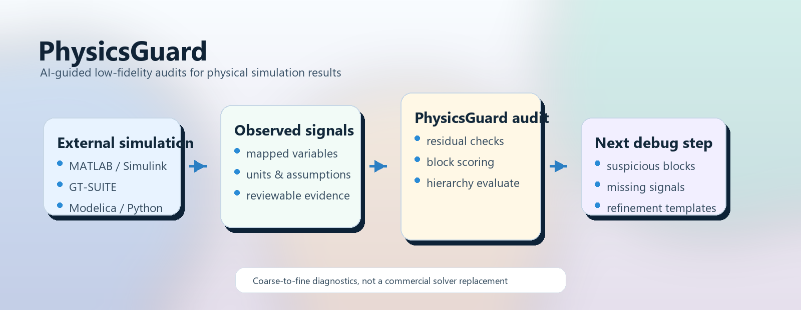

# PhysicsGuard

<!-- README HERO START -->
<p align="center">
  
</p>

<p align="center">
  <strong>Low-fidelity residual audits and model-building blueprints for physical simulation debugging.</strong>
</p>
<!-- README HERO END -->

**Version:** `v0.2.1`  
**Runtime:** Python 3.11+ with `pydantic`, `numpy`, `scipy`, and `PyYAML`  
**License:** MIT  
**Language note:** English comes first; the second half is a full Chinese mirror.

PhysicsGuard is a Python core and Codex skill for AI-assisted debugging around physical simulation workflows. It helps an AI agent build low-fidelity audit models, evaluate mapped external signals, rank suspicious blocks, recommend the next signals or parameters to inspect, and use validated hierarchies as blueprints for separate candidate models.

It is useful around engineering models built in tools such as MATLAB/Simulink, GT-SUITE, Modelica-like tools, Python simulations, and other physical simulation workflows. PhysicsGuard does **not** parse those tools, does **not** reverse engineer commercial formats, and does **not** replace the original solver. It checks exported or mapped values against explicit residual equations.

## What It Is

PhysicsGuard is a transparent audit layer with four pieces:

- YAML system and hierarchy specs;
- low-fidelity residual modules for physics, controls, and engineering sanity checks;
- direct observed-value evaluation for mapped external simulation snapshots;
- hierarchical reports that rank suspicious blocks and recommend the next useful refinement.

It can also serve as a model-building blueprint. After a low-fidelity hierarchy is validated, an AI agent may translate that blueprint into a separate candidate model through official scripting interfaces or user-owned editable templates.

## The Core Contract

PhysicsGuard is strongest when the boundary is explicit:

| Input | Check | Output |
| --- | --- | --- |
| mapped observed values from an external model | residual equations, assumptions, bounds, units, and hierarchy rollups | suspicious blocks, residual diagnostics, assumptions, and next signals to inspect |
| target model-building goal | low-fidelity hierarchy, interfaces, units, assumptions, and validation examples | candidate-model blueprint and refinement plan |

The original engineering model remains the source of truth. PhysicsGuard provides a low-fidelity audit lens that helps an AI decide where to look next.

## What It Can Help Diagnose

- unit and scale mistakes such as bar vs Pa, rpm vs rad/s, g/s vs kg/s;
- sign reversals in feedback, force, torque, pressure, flow, current, or voltage;
- broken power, heat, mass, species, or electrical-bus balances;
- bad signal mappings between external models and audit variables;
- physically impossible pressure, flow, current, voltage, temperature, or power combinations;
- map-axis misuse, wrong interpolation inputs, or unsafe extrapolation assumptions;
- inconsistent controller, actuator, sensor, saturation, clamp, delay, or sample-and-hold logic;
- scaling errors in pumps, compressors, heat exchangers, motors, inverters, fuel-cell stacks, electrolyzers, batteries, drivetrains, engines, radiators, and thermal-management loops.

## What It Is Not

PhysicsGuard is not a GT-SUITE, Simulink, Simscape, Modelica, Amesim, FMI, CSV, MATLAB, PyBaMM, or OpenFCST adapter. It does not claim equivalence with commercial solver internals. It does not perform automatic repair, CFD, 1D gas dynamics, high-fidelity electrochemistry, detailed combustion, detailed thermal-fluid simulation, or natural-language report generation.

Generated target models should be treated as candidate engineering models, not recovered copies of existing commercial models.

## Core Audit Workflow

1. Start from a visible failure: wrong final value, unstable response, impossible heat rejection, broken stack balance, or suspicious subsystem behavior.
2. Build a coarse Level 0 audit with simple balances, signal relations, units, and assumptions.
3. Map external simulation results into `ObservedValuesSpec`.
4. Run direct hierarchical evaluation:

```powershell
python -m physicsguard.cli hierarchy evaluate AUDIT.yaml OBSERVED.yaml --pretty
```

5. Inspect `top_blocks`, `top_residuals`, assumptions, and `recommended_refinements`.
6. Export only the next variables or parameters that the report actually asks for.
7. Refine the suspicious block rather than modeling the entire external system.
8. Repeat until the issue is localized to a subsystem, component, signal chain, map, parameter, unit conversion, or boundary condition.

Use compare mode only when you intentionally want a solved low-fidelity reference:

```powershell
python -m physicsguard.cli hierarchy compare AUDIT.yaml OBSERVED.yaml --pretty
```

## Candidate Model-Building Workflow

1. Define the target system and the minimum useful fidelity for each block.
2. Build the lowest-fidelity PhysicsGuard hierarchy first: balances, interfaces, units, simple components, and explicit assumptions.
3. Validate each block with PhysicsGuard examples, observed data, or conflict tests.
4. Refine one block at a time until the blueprint is detailed enough.
5. Generate a separate target model only through official APIs, documented exchange formats, or user-owned editable templates.
6. Run the generated candidate model and map its outputs back into PhysicsGuard.
7. Use residuals to decide whether to refine, reconnect, or correct the generated block.
8. Assemble larger subsystems only after their child blocks pass the relevant checks.

## Assumption Cards

PhysicsGuard uses explicit Assumption Cards. Assumptions are not silent defaults:

- active assumptions appear in diagnostic JSON;
- proposed and rejected assumptions are visible but not applied;
- high-impact assumptions produce warnings;
- assumptions are not free optimization variables;
- AI agents should ask for missing assumptions instead of inventing them.

## Quick Start

```powershell
python -m pip install -e .[test]
python -m pytest
```

Run a simple system:

```powershell
python -m physicsguard.cli run examples/dummy_system.yaml --pretty
```

Run an observed debugging hierarchy:

```powershell
python -m physicsguard.cli hierarchy evaluate examples/hierarchical/observed_debugging/pitch_feedback_level_0.yaml examples/hierarchical/observed_debugging/pitch_feedback_observed_fault.yaml --pretty
```

That example represents a mapped controller feedback signal. The fault case has a reversed sign; PhysicsGuard ranks `pitch_rate_feedback` as the top suspicious block and recommends reviewing the actual gain, sign convention, and signal mapping.

## Main CLI Modes

```powershell
python -m physicsguard.cli run SYSTEM.yaml --pretty
python -m physicsguard.cli evaluate SYSTEM.yaml OBSERVED.yaml --pretty
python -m physicsguard.cli compare SYSTEM.yaml OBSERVED.yaml --pretty

python -m physicsguard.cli hierarchy run HIERARCHY.yaml --pretty
python -m physicsguard.cli hierarchy inspect HIERARCHY.yaml --pretty
python -m physicsguard.cli hierarchy plan HIERARCHY.yaml --pretty
python -m physicsguard.cli hierarchy evaluate HIERARCHY.yaml OBSERVED.yaml --pretty
python -m physicsguard.cli hierarchy compare HIERARCHY.yaml OBSERVED.yaml --pretty

python -m physicsguard.cli assumptions inspect SYSTEM.yaml --pretty
```

## Install The Codex Skill

Ask a Codex-compatible agent:

```text
Please install the PhysicsGuard Codex skill from https://github.com/liuyingxuvka/PhysicsGuard.
The skill folder is skill/physicsguard-ai-debugging.
```

Manual local copy:

```powershell
Copy-Item -Recurse skill\physicsguard-ai-debugging $env:USERPROFILE\.codex\skills\physicsguard-ai-debugging
```

After reload, use requests such as:

```text
Use PhysicsGuard to audit this simulation snapshot and tell me which subsystem is suspicious.
```

```text
Use PhysicsGuard to design a low-fidelity blueprint for this coolant loop, validate each block, then generate a candidate Simulink model with MATLAB scripting.
```

## Library Coverage

PhysicsGuard `v0.2.1` includes low-fidelity audit relations for:

- aggregate power, heat, mass, species, and electrical-bus balances;
- control error, PID algebraic checks, PID step checks, saturation, hysteresis, thresholds, delay, sample-and-hold, actuator/sensor relations;
- thermodynamic conversion, ideal-gas density, humidity, heat exchanger, radiation, ambient heat loss, compressor sanity checks, rotating-machine affinity;
- component-level motor, inverter, DC/DC converter, compressor, pump, radiator, humidifier, intercooler, engine, fuel-cell stack, electrolyzer stack, and map checks;
- engineering components for fluid networks, thermal management, electrochemical BOP, battery/HV, drivetrain/vehicle, engine/aftertreatment, and control/sensor/actuator checks.

All modules are low-fidelity audit relations. They are intended to expose obvious mismatch, not to simulate full hardware or commercial solver behavior.

## Documentation Map

- [AI-guided debugging protocol](docs/ai_guided_debugging_protocol.md)
- [Hierarchical audit workflow](docs/hierarchical_audit_workflow.md)
- [Hierarchical YAML reference](docs/hierarchical_yaml_reference.md)
- [Assumption cards](docs/assumption_cards.md)
- [Bug playbooks](docs/bug_playbooks.md)
- [Domain starter packs](docs/domain_starter_packs.md)
- [Module spec template](docs/module_spec_template.md)

## Repository Map

```text
src/physicsguard/                 Python package
tests/                            Test suite
examples/                         YAML examples and hierarchy templates
docs/                             Workflow and schema documentation
scripts/                          Repository maintenance scripts
skill/physicsguard-ai-debugging/  Local Codex skill source
assets/readme-hero/               README hero image assets
```

## Public Boundary

This repository intentionally excludes local private data, local knowledge-base history, generated MATLAB/Simulink copied-model artifacts, and machine-specific outputs. Simulink-related material in this repository is workflow guidance or local experiment scaffolding, not a bundled adapter or redistributed commercial model.

## License

MIT License. See [LICENSE](LICENSE).

---

# PhysicsGuard 中文说明

**版本：** `v0.2.1`  
**运行环境：** Python 3.11+，依赖 `pydantic`、`numpy`、`scipy`、`PyYAML`  
**许可证：** MIT

PhysicsGuard 是一个 Python 核心库和 Codex skill，用于 AI 辅助物理仿真调试。它帮助 AI agent 构建低保真审计模型，检查映射出来的外部仿真信号，排序可疑 block，推荐下一步应该查看的信号或参数，并把验证过的层级模型作为独立候选模型的蓝图。

它适合围绕 MATLAB/Simulink、GT-SUITE、Modelica 类工具、Python 仿真和其他物理仿真工作流使用。PhysicsGuard **不会**解析这些工具，**不会**逆向商业格式，也**不会**替代原始求解器。它只把导出或映射好的数值放进显式残差方程里检查。

## 它是什么

PhysicsGuard 是一个透明审计层，包含四个部分：

- YAML system 和 hierarchy spec；
- 低保真物理、控制和工程 sanity-check 残差模块；
- 对外部仿真快照的 observed-value evaluation；
- 可以排序可疑 block 并推荐下一步 refinement 的分层报告。

它也可以作为模型搭建蓝图。低保真 hierarchy 验证后，AI agent 可以通过官方脚本接口或用户自己可编辑模板，把这个蓝图翻译成独立候选模型。

## 核心合同

PhysicsGuard 最适合边界明确的场景：

| 输入 | 检查 | 输出 |
| --- | --- | --- |
| 外部模型映射出的 observed values | residual equation、assumption、bounds、units、hierarchy rollup | 可疑 block、residual diagnostic、assumption、下一批要看的信号 |
| 目标模型搭建需求 | 低保真 hierarchy、接口、单位、假设和验证例子 | 候选模型蓝图和 refinement plan |

原始复杂工程模型仍然是真实来源。PhysicsGuard 提供的是低保真审计视角，帮助 AI 判断下一步应该看哪里。

## 它可以帮助诊断什么

- 单位和尺度错误，例如 bar vs Pa、rpm vs rad/s、g/s vs kg/s；
- feedback、force、torque、pressure、flow、current、voltage 方向反了；
- power、heat、mass、species、电气母线平衡断裂；
- 外部模型信号和审计变量之间映射错误；
- pressure、flow、current、voltage、temperature、power 组合物理上不可能；
- map 轴使用错误、插值输入错误或外推假设不安全；
- controller、actuator、sensor、saturation、clamp、delay、sample-and-hold 逻辑不一致；
- pump、compressor、heat exchanger、motor、inverter、fuel-cell stack、electrolyzer、battery、drivetrain、engine、radiator、thermal-management loop 缩放错误。

## 它不是什么

PhysicsGuard 不是 GT-SUITE、Simulink、Simscape、Modelica、Amesim、FMI、CSV、MATLAB、PyBaMM 或 OpenFCST adapter。它不声称等价于商业求解器内部逻辑，不做自动修复、CFD、一维气体动力学、高保真电化学、详细燃烧、详细热流体仿真或自然语言报告生成。

生成出来的目标模型应该被视为候选工程模型，而不是现有商业模型的还原。

## 核心审计流程

1. 从可见故障开始：最终值错误、响应发散、散热不可能、stack balance 断裂或某个子系统异常。
2. 建一个粗粒度 Level 0 审计，只包含简单守恒、信号关系、单位和假设。
3. 把外部仿真结果映射成 `ObservedValuesSpec`。
4. 运行直接分层评估：

```powershell
python -m physicsguard.cli hierarchy evaluate AUDIT.yaml OBSERVED.yaml --pretty
```

5. 查看 `top_blocks`、`top_residuals`、assumptions 和 `recommended_refinements`。
6. 只导出报告真正要求的下一批变量或参数。
7. 只细化最可疑 block，而不是建模整个外部系统。
8. 重复，直到问题收敛到子系统、组件、信号链、map、参数、单位转换或边界条件。

只有当你确实需要一个低保真参考解时，才使用 compare mode：

```powershell
python -m physicsguard.cli hierarchy compare AUDIT.yaml OBSERVED.yaml --pretty
```

## 候选模型搭建流程

1. 定义目标系统，以及每个 block 最低需要达到的 fidelity。
2. 先建最低保真 PhysicsGuard hierarchy：守恒、接口、单位、简单组件、显式假设。
3. 用 PhysicsGuard 示例、observed data 或 conflict tests 验证每个 block。
4. 一次只细化一个 block，直到蓝图足够详细。
5. 只通过官方 API、文档化交换格式或用户自有可编辑模板生成独立目标模型。
6. 运行生成的候选模型，把输出重新映射回 PhysicsGuard。
7. 用残差决定是细化、重连还是修正生成的 block。
8. 只有 child block 通过相关检查后，才组装更大的 subsystem。

## Assumption Cards

PhysicsGuard 使用显式 Assumption Cards。假设不是静默默认值：

- active assumptions 会出现在 diagnostic JSON；
- proposed / rejected assumptions 可见但不被应用；
- high-impact assumption 会产生 warning；
- assumption 不是自由 optimization variable；
- AI agent 应该询问缺失假设，而不是自己发明。

## 快速开始

```powershell
python -m pip install -e .[test]
python -m pytest
```

运行简单系统：

```powershell
python -m physicsguard.cli run examples/dummy_system.yaml --pretty
```

运行 observed debugging hierarchy：

```powershell
python -m physicsguard.cli hierarchy evaluate examples/hierarchical/observed_debugging/pitch_feedback_level_0.yaml examples/hierarchical/observed_debugging/pitch_feedback_observed_fault.yaml --pretty
```

这个例子表示一个映射后的 controller feedback 信号。fault case 符号反了；PhysicsGuard 会把 `pitch_rate_feedback` 排为最可疑 block，并建议检查实际 gain、符号约定和信号映射。

## 主要 CLI 模式

```powershell
python -m physicsguard.cli run SYSTEM.yaml --pretty
python -m physicsguard.cli evaluate SYSTEM.yaml OBSERVED.yaml --pretty
python -m physicsguard.cli compare SYSTEM.yaml OBSERVED.yaml --pretty

python -m physicsguard.cli hierarchy run HIERARCHY.yaml --pretty
python -m physicsguard.cli hierarchy inspect HIERARCHY.yaml --pretty
python -m physicsguard.cli hierarchy plan HIERARCHY.yaml --pretty
python -m physicsguard.cli hierarchy evaluate HIERARCHY.yaml OBSERVED.yaml --pretty
python -m physicsguard.cli hierarchy compare HIERARCHY.yaml OBSERVED.yaml --pretty

python -m physicsguard.cli assumptions inspect SYSTEM.yaml --pretty
```

## 安装 Codex Skill

让 Codex-compatible agent 执行：

```text
Please install the PhysicsGuard Codex skill from https://github.com/liuyingxuvka/PhysicsGuard.
The skill folder is skill/physicsguard-ai-debugging.
```

手动本地复制：

```powershell
Copy-Item -Recurse skill\physicsguard-ai-debugging $env:USERPROFILE\.codex\skills\physicsguard-ai-debugging
```

重载后可以这样请求：

```text
Use PhysicsGuard to audit this simulation snapshot and tell me which subsystem is suspicious.
```

```text
Use PhysicsGuard to design a low-fidelity blueprint for this coolant loop, validate each block, then generate a candidate Simulink model with MATLAB scripting.
```

## 模块覆盖

PhysicsGuard `v0.2.1` 包含这些低保真审计关系：

- aggregate power、heat、mass、species、电气母线平衡；
- control error、PID algebraic checks、PID step checks、saturation、hysteresis、threshold、delay、sample-and-hold、actuator/sensor 关系；
- thermodynamic conversion、ideal-gas density、humidity、heat exchanger、radiation、ambient heat loss、compressor sanity checks、rotating-machine affinity；
- component-level motor、inverter、DC/DC converter、compressor、pump、radiator、humidifier、intercooler、engine、fuel-cell stack、electrolyzer stack、map checks；
- fluid networks、thermal management、electrochemical BOP、battery/HV、drivetrain/vehicle、engine/aftertreatment、control/sensor/actuator 工程组件。

所有模块都是低保真审计关系，用来暴露明显 mismatch，不模拟完整硬件或商业求解器行为。

## 文档入口

- [AI-guided debugging protocol](docs/ai_guided_debugging_protocol.md)
- [Hierarchical audit workflow](docs/hierarchical_audit_workflow.md)
- [Hierarchical YAML reference](docs/hierarchical_yaml_reference.md)
- [Assumption cards](docs/assumption_cards.md)
- [Bug playbooks](docs/bug_playbooks.md)
- [Domain starter packs](docs/domain_starter_packs.md)
- [Module spec template](docs/module_spec_template.md)

## 仓库结构

```text
src/physicsguard/                 Python package
tests/                            测试
examples/                         YAML 示例和 hierarchy templates
docs/                             工作流和 schema 文档
scripts/                          仓库维护脚本
skill/physicsguard-ai-debugging/  本地 Codex skill 源码
assets/readme-hero/               README hero 图资产
```

## 公开边界

这个仓库有意排除本地私人数据、本地知识库历史、生成的 MATLAB/Simulink copied-model artifacts 和机器特定输出。仓库里的 Simulink 相关内容是工作流指导或本地实验脚手架，不是 bundled adapter，也不是重新分发的商业模型。

## 许可证

MIT License。见 [LICENSE](LICENSE)。
