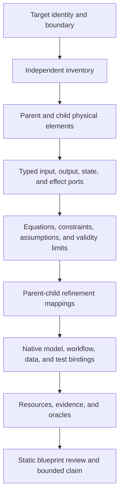

# Physical Model Blueprint

The Physical Model Blueprint is PhysicsGuard's canonical, provider-neutral
description of an external physical target. It is the target's inspectable
"physical DNA": one connected record of what exists, how physical information
flows, which state changes, what each layer means, and which native artifacts
support those statements.

The target can be a simulation model, experiment, testbench, physical system,
or mixed physical workflow. The contract is not tied to Python, a particular
simulation language, or a particular vendor. A provider may describe a
Modelica model, a hardware testbench, a folder of measurements, a generated
model, or another physical workflow as long as it supplies the exact identities
and evidence required by the blueprint.

The blueprint is a living engineering artifact. It can start with a bounded
outer model and grow inward as interfaces, state, equations, validity limits,
tests, and resources become known. A review reports the depth that is actually
supported; it does not turn an incomplete model into a complete one.

## The connected model



Every physical element behaves conceptually as:

```text
Input × Current State -> Set(Output × Next State × Effects)
```

The `Set(...)` matters. A physical component may have several valid outcomes,
an invalid operating region, or an unresolved branch. The blueprint keeps
those alternatives visible instead of inventing one deterministic result.
Stateful behavior records the initial state, update rule, and termination
condition. Pointwise equations alone cannot stand in for temporal behavior.

## One canonical object

A blueprint uses schema
`physicsguard.physical-model-blueprint.v1` and contains these connected parts:

| Part | What it answers |
| --- | --- |
| Target identity | Exactly which external physical target and revision are being described? |
| Providers | Which source supplied each inventory or native observation, with which current capabilities? |
| Independent inventory | What is in the declared target boundary, including modeled, supporting, excluded, unsupported, and unresolved members? |
| Physical elements | What are the system, subsystems, components, experiment, testbench, model, or physical-workflow nodes? |
| Ports | What enters, leaves, persists as state, or occurs as an effect, with units, frames, and time meaning? |
| Semantics | Which equations, residuals, constraints, updates, assumptions, invariants, conservation laws, conversions, guarantees, and termination rules apply? |
| Validity boundaries | Where is a statement valid, invalid, unsupported, or unsafe to generalize? |
| Refinements | How do a parent's ports and semantics arise from its immediate children? |
| Native bindings | Which exact model, workflow, source, test, dataset, observation, evidence, oracle, project record, library record, hierarchy, validation, or model revision supports each element? |

All identifiers are explicit. There is exactly one root physical element. A
child's depth is exactly its parent's depth plus one, so a model cannot skip a
level while claiming a continuous hierarchy. Every inventory member and native
binding must have one visible disposition or owner; unknown ownership is a gap,
not permission to ignore the member.

## Review depth

The read-only reviewer checks eight ordered layers. The deepest licensed layer
is the deepest continuous prefix that has no gap.

| Layer | Plain-language question |
| --- | --- |
| `target_inventory` | Do we know the exact target boundary and have an independently supplied inventory for it? |
| `hierarchy_ownership` | Is there one connected parent-child hierarchy, and does every governed item have the correct owner? |
| `typed_interfaces` | Are inputs, outputs, state, effects, units, frames, and time semantics connected without dangling endpoints? |
| `independent_physical_semantics` | Are the physical relations and validity limits stated independently rather than inferred only from implementation prose? |
| `parent_child_refinement` | Do immediate children account for the parent's ports, state, effects, semantics, and validity boundaries? |
| `native_model_code_test` | Are model/workflow/source/test/data identities bound to the exact elements and obligations they support? |
| `resource_oracle` | Are evidence, resources, and expected-result oracles current and connected? |
| `static_blueprint` | Do all earlier layers close into one internally consistent blueprint for the selected scope? |

A passing review means that the declared scope satisfies this contract with
current evidence. It does not prove high-fidelity physical equivalence, solver
correctness, or facts outside the declared validity boundary. A sufficiently
deep blueprint can guide implementation, translation, comparison, and defect
localization, but those outcomes still require target-owned engineering and
validation evidence.

## Native evidence and identity

The reviewer distinguishes several evidence strengths so that a matching file
name or hash cannot silently become a stronger claim:

- A supported typed local artifact must match its declared native schema,
  exact root subject identity, revision envelope, and content fingerprint.
- A generic local artifact can prove only the bytes that were read. Its SHA-256
  does not prove which physical subject or semantics those bytes represent.
- An external artifact needs a current provider observation whose fingerprint
  binds the provider, target subject, revision, binding kind, native schema,
  artifact SHA-256, semantic IDs, obligation IDs, and status. This proves the
  supplied identity envelope; it does not claim that PhysicsGuard read remote
  content that was unavailable locally.
- Missing, stale, unsupported, ambiguous, cross-subject, or foreign-owner
  evidence remains a visible non-pass result. There is no repository-scan or
  alternate-reader fallback that upgrades it.

The current typed adapters cover hierarchical audits, project evidence
registries, data-file manifests, logical dataset records, test-file contracts
and project indexes, validation depth records, model validation plans, model
library indexes, native depth records, candidate-model revisions, and evidence
meshes. A schema without a stable primary subject identity stays blocked rather
than being accepted by resemblance.

## Reading only the depth needed

The blueprint is one canonical object, but an AI does not need to load every
detail for every task. Four deterministic projections control context size:

| Projection | Use |
| --- | --- |
| `summary` | Establish target identity, overall depth, first gap, and safe claim. |
| `affected` | Follow a named changed element, interface, provider, inventory member, binding, or obligation through relations that can actually carry that change. |
| `reverse_trace` | Start from a failing test, observation, resource, oracle, or semantic and trace back to its physical owners and dependencies. |
| `full` | Inspect the whole declared boundary for a deliberate whole-model audit or closure. |

Projection fingerprints bind the source blueprint, source review, relation set,
recipe, target, revision, seeds, nodes, edges, included members, outside-scope
members, and gaps. Unknown or ambiguous seeds block the projection rather than
quietly broadening it. Unconnected siblings remain outside scope.

This is how the same physical DNA supports both lightweight and deep use: the
stored model can be detailed while an ordinary task consumes only the slice it
needs.

The single qualification command intentionally remains `blueprint review`.
Compact projections are read-only Python API views of that same authority, not
additional CLI success paths. An AI or application can invoke them exactly as
follows:

```python
from pathlib import Path

from physicsguard import (
    affected_physical_blueprint_projection,
    full_physical_blueprint_projection,
    reverse_trace_physical_blueprint_projection,
    review_physical_model_blueprint,
    summary_physical_blueprint_projection,
)
from physicsguard.io import (
    load_physical_model_blueprint,
    load_target_inventory_authority,
)

path = Path("target/physical_blueprint.yaml")
authority_path = Path("target/target_inventory_authority.yaml")
blueprint = load_physical_model_blueprint(path)
authority = load_target_inventory_authority(authority_path)
review = review_physical_model_blueprint(
    blueprint,
    target_inventory_authority=authority,
    base_dir=path.parent,
    authority_base_dir=authority_path.parent,
)

summary = summary_physical_blueprint_projection(blueprint, review)
affected = affected_physical_blueprint_projection(
    blueprint,
    review,
    ["port.pump.discharge_pressure"],
    target_inventory_authority=authority,
    blueprint_base_dir=path.parent,
    authority_base_dir=authority_path.parent,
)
reverse = reverse_trace_physical_blueprint_projection(
    blueprint,
    review,
    ["port.loop.flow"],
    target_inventory_authority=authority,
    blueprint_base_dir=path.parent,
    authority_base_dir=authority_path.parent,
)
full = full_physical_blueprint_projection(blueprint, review)
```

Affected and reverse-trace seed sets are atomic. If any requested identity is
unknown, ambiguous, or stale, PhysicsGuard returns a bounded gap and no partial
member set for the remaining seeds. Each query reruns the canonical reviewer
exactly once against the same blueprint artifact root, frozen authority, and
raw target material that licensed the supplied review. The supplied review
must equal that exact-current passing result field-for-field. A changed
blueprint binding or material file, a foreign or self-rehashed review, a
different authority, or a missing root makes the query non-pass before graph
compilation; the read-only query never repairs or rewrites any source artifact.

## Artifact-root rule

The directory containing the blueprint file is its one and only artifact root:

```yaml
artifact_root: blueprint_directory
```

Every local `repo_path` is a forward-slash relative path resolved from that
directory. Absolute paths, `..`, and a second inferred repository root are
invalid. Put the blueprint at the root whose relative artifact paths it names.
For example, the pump-loop blueprint lives beside the `model/`, `contracts/`,
`resources/`, and other folders it binds.

## Review command

Review one YAML or JSON blueprint without executing the target:

```powershell
python -m physicsguard.cli blueprint review BLUEPRINT.yaml --target-authority AUTHORITY.yaml
python -m physicsguard.cli blueprint review BLUEPRINT.json --target-authority AUTHORITY.json --pretty
```

`AUTHORITY` is a frozen `TargetInventoryAuthority` issued outside the
caller-owned blueprint. It names the exact current owner, request, inputs,
target revision, and adapter execution used to produce it. The authority is
required; provider capability ownership comes only from PhysicsGuard's
runtime-closed current registry, which has no caller option. A locally supported
inventory adapter is replayed during review; an external authority that cannot
be replayed remains `unverified`.
The blueprint inventory must equal the authority inventory in both directions,
so deleting a model branch and recomputing caller-owned fingerprints cannot
shrink the governed denominator.

Without `--pretty`, the command emits compact canonical machine JSON. With
`--pretty`, it formats the same review object for reading; status, gaps,
fingerprints, and claim boundaries are identical. Both forms are read-only:
they do not rewrite the blueprint, emit a receipt, create project files, run a
simulation, install a skill, or mutate a cache.

The command returns machine-readable JSON and uses these exit codes:

| Exit | Meaning |
| --- | --- |
| `0` | The declared review scope passes. |
| `2` | The YAML/JSON did not load as the canonical schema. |
| `3` | The blueprint is incomplete or otherwise blocked by a non-adapter gap. |
| `4` | At least one required item is stale. |
| `5` | A provider capability or native binding is missing, unsupported, mismatched, or not current. |

The result includes the blueprint, external inventory-authority, runtime capability-registry,
and inventory fingerprints, per-layer
results, deepest licensed layer, deterministic first gap, exact governed and
covered members, identity-only limitations, safe claim, unsafe claim boundary,
and logical report fingerprint.

## Authoring and maintaining a blueprint

Use [`templates/physical_model_blueprint.yaml`](../templates/physical_model_blueprint.yaml)
as structural guidance. It deliberately contains placeholder external
identities; copying it is not evidence and will not produce a passing review
until target-owned identities and observations replace those placeholders.

A normal maintenance cycle is:

1. Freeze the exact external target, revision, purpose, boundary, and required
   provider capabilities.
2. Build the independent inventory, including exclusions and unresolved items.
3. Add one root element and immediate child layers; connect typed ports,
   physical semantics, state lifecycle, validity boundaries, and refinement
   mappings.
4. Bind each modeled or supporting member to its exact native artifact,
   semantics, obligations, and validation modes.
5. Run the whole review once to establish the current authority.
6. For a later change or defect, request the affected or reverse-trace
   projection, update only the owned slice and its dependent evidence, then
   review that scope with fresh identities.
7. Use a full projection again only when the requested claim covers the whole
   boundary or a release/closure gate requires it.

Only `physicsguard-candidate-model-blueprint` owns full blueprint authoring and
review. The other PhysicsGuard skills consume route-specific projections:
preflight reads the first useful layer, file-contract review binds concrete
ports, mapping review checks affected interfaces and consumers, validation
reports coverage per element and obligation, the project registry preserves
evidence ownership, debugging follows a trace, adoption records blueprint
identity, the library verifies reuse limits, and audit closure reconciles the
exact requested boundary.

## Public pump-loop example

The maintained example has three physical hierarchy levels and binds model,
test, data, project, resource, validation, library, and evidence artifacts:

```powershell
python -m physicsguard.cli blueprint review examples/testfile_contracts/pump_loop/pump_loop_physical_blueprint.yaml --target-authority AUTHORITY.yaml --pretty
```

Its claim is intentionally narrow: the repository fixture's declared
`y = 2*x` relation and sampled valve context. A pass does not claim real-pump
fidelity or between-sample dynamics.

## Boundary with FlowGuard

This blueprint owns the physical-domain description of the external target.
FlowGuard may model PhysicsGuard itself as software: its commands, state
transitions, prompts, implementation paths, and release process. PhysicsGuard
does not import FlowGuard at runtime and does not use a software model as a
substitute for physical equations, validity limits, native testbench evidence,
or provider observations.
