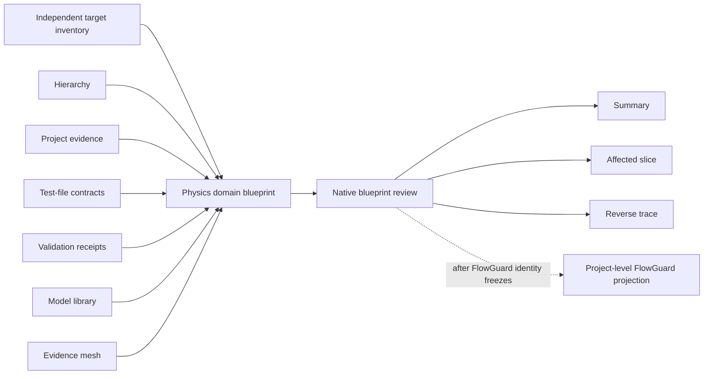

## Context

See `proposal.md` for motivation and the seven delta specifications for the observable contracts.

PhysicsGuard already has several useful but separate authorities: hierarchical audit blocks, module metadata, model-understanding preflight, project evidence, test-file contracts, model-dataset validation, reusable model-library entries, task-local revision receipts, and an evidence mesh that connects model obligations to code and tests. The current hierarchy is primarily a diagnostic roll-up structure; it does not prove that a parent's inputs, outputs, states, assumptions, validity, and guarantees are composed from its children. Existing evidence bindings are valuable navigation and closure inputs, but do not independently establish a complete physical target inventory or physical-semantic denominator.

FlowGuard 0.68.6 already owns generic implementation inventory, generic software-blueprint layers, target-system provider composition, generic readiness, affected projection, and compact understanding summaries. The installed FlowGuard runtime currently resolves to an editable checkout with concurrent blueprint work, so its eventual projection interface is not yet a frozen implementation dependency. PhysicsGuard must be useful and installable without FlowGuard and must not copy FlowGuard's generic engine into its product runtime.

PhysicsGuard also maintains ten independent skill routes under one SkillGuard author unit. Their compact entry prompts, one-level conditional reference loading, exact native owners, no-fallback policy, installed projection, and current receipt semantics must survive this change. A repository-local FlowGuard model system governs development evidence, but generated model revisions, snapshots, activations, SkillGuard receipts, and installation receipts are outputs of their owners rather than hand-authored source.

## Goals / Non-Goals

**Goals:**

- Establish one canonical PhysicsGuard physical-domain blueprint with exact target identity, independent inventory, one rooted hierarchy, typed physical interfaces, compositional refinement, independent semantics, and exact native bindings.
- Make understanding depth machine-derived and inspectable through one read-only `blueprint review` CLI path.
- Reuse existing hierarchy, project-evidence, evidence-mesh, test-contract, validation, model-library, and task-local authorities by reference instead of copying their contents into a second ledger.
- Provide deterministic affected-only and reverse-trace projections over the current physical blueprint.
- Give every behavior-bearing physical element one explicit transition-and-oracle contract covering input, pre-state, output, post-state, effect, precondition, protected failure, termination, and source-independent oracle ownership.
- Materialize one deterministic portable physical-DNA bundle that an internal isolated verifier can check without repository access for hierarchy, interface, state, impact, and reverse-trace slices.
- Admit physical systems, experiments, testbenches, models, and workflows regardless of implementation language or vendor tool.
- Keep PhysicsGuard physical semantics independent of FlowGuard at product runtime while defining a later project/integration projection boundary.
- Update all ten maintained skill routes so each route loads and consumes only its exact current summary, affected slice, or deep blueprint.
- Qualify the native capability against an independently inventoried representative external physical system, experiment/testbench, and model boundary before release.
- Keep PhysicsGuard software's own software-DNA model under FlowGuard ownership and use that separate FlowGuard model for the final software-structure audit.
- Keep that software DNA repository-native: its definition, hierarchy, model-code-test/resource bindings, indexes, and evidence references are the DNA, and one read-only in-place check is its only PhysicsGuard public operation.

**Non-Goals:**

- Reimplement FlowGuard's generic implementation inventory, software ownership graph, generic blueprint qualification, affected reader, or compact projection inside PhysicsGuard.
- Replace PhysicsGuard's solver, residual evaluator, hierarchy runner, project evidence, test-file, dataset-validation, model-library, or task-local revision owners with a new evaluator.
- Require Python source, a particular commercial modeling tool, or direct access to proprietary source as the target boundary.
- Add a second `blueprint check`, `blueprint validate`, `blueprint inspect`, or target-specific success command alongside `blueprint review`.
- Make target execution, empirical validation, or model generation part of every blueprint review. Those remain separate native actions when the requested claim needs them.
- Claim that static blueprint qualification alone proves physical truth, high-fidelity equivalence, or universal reconstructability.
- Treat a portable bundle or an AI's correct answers as fresh target execution, empirical validation, high-fidelity reconstruction, or authority beyond the frozen review and included evidence manifest.
- Add compatibility readers, shape aliases, silent schema migration, fallback providers, cached-summary authority, or automatic run-all behavior.
- Bind the FlowGuard projection to the currently dirty editable FlowGuard checkout.
- Export, materialize, reconstruct, package, or publish a second canonical copy of PhysicsGuard's own software DNA.

## Decisions

### 1. PhysicsGuard owns physical semantics; FlowGuard owns the generic skeleton

The ownership boundary is semantic, not based on file location:

| PhysicsGuard owns | FlowGuard owns |
| --- | --- |
| Physical quantities, units, time basis, state, effects, equations, residuals, constraints, assumptions, validity, conservation, physical refinement, native physical evidence, and physical claim limits | Generic implementation inventory, generic code/surface ownership, generic target-provider composition, generic model-code-test/resource layering, generic affected projection, and generic understanding summaries |

PhysicsGuard's installable package will contain no `flowguard` import and no FlowGuard runtime dependency. A later project-level adapter may import both packages after the FlowGuard source and installed interface are frozen. That adapter can translate a qualified PhysicsGuard result into FlowGuard provider/layer objects, but cannot reinterpret or upgrade the PhysicsGuard status.

Alternative considered: use FlowGuard classes directly in the PhysicsGuard schema and CLI. Rejected because it makes an external development-governance package a product runtime dependency and couples PhysicsGuard releases to a currently changing generic interface.

Alternative considered: duplicate FlowGuard's blueprint and affected-reader classes under PhysicsGuard names. Rejected because it creates two generic authorities that will drift and forces future targets to choose which generic result is current.

### 2. Add one canonical physical blueprint artifact rather than widening every existing schema

The new schema module will define a strict, versioned artifact centered on these conceptual records:

- blueprint identity and target boundary;
- independently discovered inventory members and their terminal dispositions;
- typed physical interfaces;
- physical semantic elements keyed to existing hierarchy blocks or native target members;
- parent/child refinement contracts;
- exact references to existing native artifacts and evidence members;
- qualification findings, ordered layer results, first gap, deepest licensed layer, and safe claim.

Existing `HierarchicalAuditSpec`, `EvidenceMeshSpec`, project-evidence records, test-file contracts, validation receipts, and model-library records remain their current authorities. The blueprint stores their ids, paths or external references, subject revisions, and fingerprints, then the reviewer loads and checks those native artifacts. It does not duplicate their full payloads.

The Pydantic schema will use `extra="forbid"`, exact enumerations for status and relation kinds, stable string identities, canonical sorting, bounded relative paths or authorized external references, and content-addressed fingerprints. YAML and JSON are presentation formats for the same canonical logical object. `artifact_root: blueprint_directory` has one meaning: every local `repo_path` resolves forward from the directory containing that blueprint. The reviewer does not infer a repository root, accept `..`, or preserve a second `model/`-relative path convention.

Alternative considered: add input/output/state/effect and binding fields directly to every existing hierarchy, module, project-evidence, test-contract, and library record in one migration. Rejected for the first implementation because it creates a broad breaking rewrite before the cross-artifact composition rules have one executable owner. The blueprint will first compose current authorities; later field moves require their own lifecycle evidence.

### 3. Independent inventory precedes qualification

Blueprint completeness cannot be derived from the blueprint's own member list. `IndependentInventory` and `ProviderResult` inside the blueprint are caller projections, not denominator authority. Every review therefore takes a separate frozen `TargetInventoryAuthority`, but it never accepts a provider registry from the caller. PhysicsGuard's runtime-closed registry freezes only current adapter capability, execution owner, tool/version, execution mode, input shape, and supported raw schema. It deliberately does not whitelist target ids, requests, revisions, locators, or hashes. A supported local adapter is replayed during review; an unknown or otherwise unreplayable adapter is `unverified`.

The local target-material adapter derives provider, target, inventory id, subject revision, boundary, and a **declared projection** of inventory members from a raw target-material document. That document identifies physical elements, ports, semantics, validity boundaries, and native materials, but contains no caller-selected `modeled`, `supporting`, `excluded`, `unsupported`, or `unresolved` verdict rows. Its material-revision fingerprint is derived from the canonical observable content and its request id is derived from that material revision. This is sufficient only for `declared_consistency`: because the same author can shrink the target-material document and blueprint together, it is not by itself an independently observed object denominator.

For `object_dna`, at least one current native adapter must inspect the actual governed object and emit the single provider-neutral `physicsguard.native-object-dna-observation.v1` contract independently of the blueprint's selected elements, ports, semantics, cases, and mappings. Each census member has a stable source identity, kind, locator, role, content/contract fingerprint, and optional independently owned semantic fact. The same contract also carries the adapter-owned behavior-case universe, native case results, and their fingerprints. The reviewer keeps the full observed census and case universe even when the requested blueprint or expected-member list is smaller. It then reconciles every observed source member with exactly one explicit source-to-model mapping or evidenced terminal disposition, and checks every modeled behavior-bearing target has reverse coverage. FMI remains one strict `fmi.v1` adapter profile: it discovers every archive member and every XML variable from actual bytes, then adds exact native case results and restricted oracle facts. A bounded `structured-object.v1` profile observes one exact current structured object document and emits the same neutral contract for non-FMI software, experiments, documents, models, or workflows. The profile claim covers only that exact document boundary and cannot imply completeness for inaccessible external material.

If raw bytes change after authority issuance, or target/revision/request/result/terminal identities differ from the current raw snapshot, qualification is stale or blocked. If a user deliberately supplies different raw material with a newly derived material revision and request, it is reviewed as a new target snapshot rather than rejected by a fixture whitelist. That new snapshot can pass lightweight declared consistency immediately, but it cannot inherit object-DNA readiness until its newly observed census and mappings close again.

The adversarial boundary is therefore precise: shrinking blueprint, caller inventory, authority projection, expected-member subsets, cases, or mappings while leaving the observed target unchanged cannot shrink object-DNA coverage, because native replay restores the complete observable source denominator. The runtime does not pretend it can infer physical truth that is absent from every independent source, or distinguish a genuinely replaced physical target from maliciously replaced source material; an explicit, internally coherent new material revision is a new review subject and starts without inherited object-DNA readiness.

The first implementation accepts canonical YAML/JSON target-material snapshots through one provider-neutral inventory adapter and accepts object-DNA evidence through the FMI and bounded structured-object profiles of the one native-observation contract. Further target-specific adapters converge on that same reviewer without adding target whitelists, caller registries, or provider-specific reviewer branches.

### 3A. Understanding depth and readiness are separate machine results

Every blueprint explicitly requests either `declared_consistency` or `object_dna`. The reviewer always derives declared-consistency status from the supplied hierarchy, interfaces, semantics, bindings, and authority. It separately derives object-DNA readiness from native source census closure, source-to-model and model-to-source coverage, native case/result alignment, and source-independent semantic comparisons. A `declared_consistency` review reports object-DNA readiness as `not_requested`; it never silently defaults, upgrades, or borrows readiness from a bundle, count, or prior review. An `object_dna` review is non-pass when any required census member, mapping, semantic fact, or native result is missing, stale, ambiguous, or mismatched.

The report and physical-target portable bundle carry both statuses, the source-census fingerprint, mapping coverage, and the first object-DNA gap. This keeps lightweight use cheap and honest while giving deep use an executable completion boundary; it does not create a portable self-DNA path for PhysicsGuard's own repository.

### 3B. Native behavior results and semantic facts close the declaration loop

Caller-authored `observed_*` values and `status: pass` are model claims, not execution evidence. In `object_dna` mode every behavior case binds one exact replayable native result and maps each model port to one native observed value with an explicit tolerance. The reviewer compares the native result, expected values, claimed observed values, effect and terminal status; changing a claimed result such as `999` therefore fails even when its local fingerprint is recomputed.

Likewise, an equation string is not validated merely because a binding names it. A source mapping may bind a semantic to an independently owned restricted expression or oracle fact emitted by the native adapter. The reviewer compares normalized expressions and blocks on a mismatch. This detects a blueprint-only sign or operator change while keeping the claim bounded: rewriting both the governed source and every independent oracle is a new source snapshot, not something a static reviewer can identify as universal physical falsehood.

### 3C. Whole and affected review identities never collide

The review identity includes the blueprint fingerprint, review scope, exact selected-element closure, and full source/inventory denominator fingerprints. An affected review retains the global denominator and explicitly reports the selected and outside-scope members; it may limit checks and token output to the affected closure, but it cannot erase the existence of the rest of the target or reuse a whole-review identity.

### 4. Physical composition is checked as explicit conservation of interfaces and claims

The hierarchy reviewer will require exactly one root for one blueprint boundary and one primary owner for every modeled behavior, interface, state, and effect. For every parent/child refinement it will derive and check:

- each required child input has a parent, sibling, state, or external source;
- each child output is consumed, exported, retained as state, or terminally dispositioned;
- child state is represented at the parent or explicitly child-local;
- parent outputs and states have an explicit child or parent-owned semantic source;
- units, quantity kinds, time bases, value shapes, and connection directions agree or bind an exact conversion;
- child assumptions and validity restrictions are visible in the parent claim;
- conserved quantities and guarantees are preserved or explicitly weakened with bounded evidence;
- side effects and provider-owned effects have one owner and a visible propagation boundary.

The result is not a numerical solver. It is a static semantic and evidence closure check that explains why a parent is licensed to summarize its children.

### 5. Understanding depth is an ordered, derived result

The native reviewer will compute ordered layer results:

1. target boundary and independent inventory;
2. rooted hierarchy and ownership;
3. typed interfaces and connections;
4. independent physical semantics;
5. parent/child refinement;
6. native model-code-test binding;
7. resource-oracle binding;
8. static blueprint closure.

Each layer is `pass`, `incomplete`, `stale`, or `blocked` and names its exact gap ids. The deepest licensed layer is the last contiguous passing layer; a later passing fragment cannot skip an earlier gap. The report includes the first unresolved gap, all requested-scope blockers, blueprint and report fingerprints, affected element ids, and a bounded safe claim. Caller-supplied readiness fields are ignored or rejected.

This layer result is PhysicsGuard's domain projection. A later FlowGuard adapter maps it to FlowGuard's generic blueprint layers without recomputing the domain findings.

### 6. One read-only CLI is the only qualification entry

The public route is:

```text
python -m physicsguard.cli blueprint review BLUEPRINT --target-authority AUTHORITY --pretty
```

The public loaders detect only the current canonical blueprint and target-authority schemas and parse YAML or JSON into exact current models. The provider/request registry is internal current runtime authority and has no public loader or caller path. The blueprint and authority containing directories are their explicit local artifact roots; no repository-root inference or path alias is attempted. The authority path is mandatory. The command prints canonical JSON, returns zero only when the requested review scope qualifies, and returns non-zero for incomplete, stale, blocked, invalid, unknown, or retired shapes. It does not write a receipt or transformed artifact unless a later separately specified output command is introduced; this change does not introduce one.

Target-specific adapters produce canonical inputs or provider results. They do not receive their own qualification command. This keeps documentation, tests, skills, and automation on one path.

### 7. Impact and reverse trace use one typed graph with deterministic closure

The blueprint compiler will project current elements and bindings into a typed directed graph. Node kinds include target, inventory member, physical element, interface, semantic, refinement, implementation/workflow, test, dataset, observation, evidence, oracle, resource, provider, and claim. Relations carry direction, owner, requiredness, subject revision, and fingerprint.

Affected and reverse queries first run one shared qualified-source gate. Before graph compilation, indexing, or seed handling, that gate calls the canonical reviewer exactly once with the exact blueprint, frozen target-inventory authority, blueprint artifact root, and authority artifact root. The supplied review must equal the resulting current `pass` report field-for-field; a foreign, incomplete, blocked, stale, or caller-rehashed report produces one atomic empty projection and is never silently replaced with the newly computed result.

Affected traversal then begins from exact changed ids and follows only relation kinds declared to propagate change. It adds required ancestors, dependent descendants, connected siblings, shared-resource consumers, claim consumers, and validation owners. Every included member records its inclusion edge; omitted branches are outside scope, not passed.

Reverse trace begins from an output, result, diagnostic, layer, or claim and follows supporting relations toward inputs, states, semantics, artifacts, tests, datasets, evidence, resources, and providers. It stops at unknown, ambiguous, unsupported, or stale boundaries and reports those gaps.

The same blueprint fingerprint, seed ids, scope, relation-set fingerprint, and canonical ordering yield the same logical projection fingerprint. Ambiguity never selects an arbitrary path or triggers automatic whole-project work.

### 8. Native artifact bindings remain references to their direct owners

The blueprint will use adapters/loaders around current PhysicsGuard artifacts:



Bindings are checked bidirectionally within the requested denominator: every required blueprint element has the native bindings needed for its layer, and every required referenced native obligation has one blueprint owner or an evidenced disposition. A string name without a current referenced object and fingerprint contributes no closure.

The first direct adapter set covers the hierarchy, project-evidence registry, standalone project profile, test-file contract and project index, signal-mapping ledger, logical dataset, validation plan and report, model-library index, task-local native-depth and candidate-revision records, and evidence mesh. The standalone project profile and signal-mapping ledger have their own stable primary identities and self-fingerprints; neither borrows the enclosing evidence registry or an incidental source-file name as authority.

Content identity and native execution are separate facts. A local typed artifact may prove current bytes, parse under the native schema, and expose the expected subject while still remaining `unverified` for an executable claim. A replayable binding qualifies the native model/code/test or resource/oracle layer only when its declared PhysicsGuard owner actually replays the exact input and reproduces a terminal receipt bound to owner, operation, target, subject revision, tool version, expected status, and terminal fingerprint. A provider-observed external reference remains a bounded identity-only result when that owner cannot be replayed locally; it is never promoted from hash integrity to execution evidence.

### 9. Skill loading uses summary, affected, and deep projections

The ten direct skill routes keep their existing owners. `physicsguard-candidate-model-blueprint` is the only direct skill that authors or qualifies the canonical blueprint. Other routes consume exact portions:

- ordinary route selection or a bounded read uses the compact summary;
- a targeted audit or change uses an affected slice and required shared objects;
- whole-target understanding, deep model revision, interchange qualification, or closure uses the full current blueprint;
- a route with no relevant blueprint mutation records consumption or not-applicable status and does not create a revision.

Each capsule declares when its own native blueprint reference is loaded. No route loads another skill's private references, all ten prompts, or the full blueprint by default. Existing entry byte and maximum-reference-depth checks remain hard gates. A missing or stale summary/slice fails visibly and never falls back to loading the full source tree or another cached projection.

Every changed skill remains under SkillGuard author supervision. Its source contract adds exact target-native blueprint checks and inputs; generated author receipts and installed consumer projections are created by their owners. SkillGuard validates identity and evidence only, while PhysicsGuard retains the physical meaning and native predicates.

### 10. Consumer installation has one SkillGuard-owned transaction path

PhysicsGuard freezes only the exact `unit:physicsguard-family` membership and
the required suite ordering. It does not own a second consumer-file algorithm,
manifest validator, filesystem transaction, receipt format, installation lock,
or rollback implementation. The read-only installed-skill checker dynamically
loads the consumer planner and auditor from the explicitly selected current
installed SkillGuard root, verifies that the imported modules resolve to that
root, derives each source release from its current compiled contract, and
compares the full plan identity and file list with SkillGuard's installed-tree
audit. Missing or foreign SkillGuard authority, unsafe roots, symlinks, author
control paths, manifest drift, release drift, missing files, and unexpected
files are visible blockers. The readiness audit consumes this same suite result
instead of reimplementing consumer comparison.

The suite installer is a thin exact-ten coordinator over SkillGuard's public
target-installation API. It obtains all ten source plans, prepares all ten
stages, and verifies all ten stages before the first activation. It then
activates one member at a time. If an activation fails, every earlier successful
activation is rolled back through SkillGuard in reverse activation order; a
rollback failure remains explicit. SkillGuard retains ownership of projection,
stage contents, path safety, locks, journals, receipts, recovery, activation,
and rollback. If the current API is unavailable or incomplete, the coordinator
stops at a visible plan/API block and never substitutes a local installer.

The contract generator classifies the whole `skill/<id>/.skillguard` subtree as
author-only `source_only` material. It resolves FlowGuard version/schema from
the explicit project adoption record and the importable current package, and it
resolves SkillGuard from the path-validated installed API plus package metadata.
An authority mismatch blocks generation instead of preserving a historical
version literal. Because the active FlowGuard identity is still moving, this
change updates the generator source only; regenerated contracts, installation,
and release closure remain pending until the FlowGuard authority is frozen.

The ten member contracts retain 84 physical-domain and model owners. One
additional family process owner,
`owner:physicsguard-family:distribution-authority`, is declared exactly once in
the `physicsguard-audit-closure` member only because the current SkillGuard
schema requires every check to live in one registered member. Its identity and
evidence domain remain family-level: it owns generator currentness, the single
root TestMesh definition, exact-ten distribution/installation ordering,
installed currentness, and readiness projection. It owns no physical-domain
predicate and its receipt cannot license an audit-closure claim. The other nine
members neither duplicate this check nor consume its maintenance-only inputs.

The root static TestMesh audit runs once for the family and proves the exact
84-domain-plus-one-process topology without executing an owner. Member-local
checks continue to prove only their prompt, route, guard model, and exact native
blueprint implementation/test inputs. The complete physical-blueprint surface
is not copied into all ten members: candidate author/review files bind to the
candidate owner; mapping, evidence, dataset/validation, and closure files bind
to their already existing direct route owners.

### 11. FlowGuard projection is deliberately delayed

Native PhysicsGuard schema, review, impact, trace, tests, skill contracts, and representative external-target qualification can be implemented and validated independently. FlowGuard projection begins only when all of these are true:

- the selected FlowGuard source commit and release/tag are explicit;
- the active Python import resolves to that frozen source rather than a dirty peer worktree;
- installed package and public blueprint API identities are current;
- PhysicsGuard's FlowGuard project adoption has been upgraded and audited;
- the PhysicsGuard blueprint schema and report are stable enough to project without a dual path.

The later adapter belongs under repository integration/governance, not `src/physicsguard`. It consumes canonical PhysicsGuard output and FlowGuard public APIs, preserves fingerprints and non-pass states, and maps domain layers to generic layers. It neither imports FlowGuard from the PhysicsGuard package nor copies FlowGuard classes into the product schema.

### 12. Direct-current replacement applies to blueprint artifacts and prompts

There is no previously supported executable blueprint schema or CLI, despite the README mentioning the command. The new schema becomes the only accepted shape when released. Old descriptive hierarchy or ledger files remain valid under their own existing routes but do not masquerade as the new blueprint. There will be no compatibility reader that guesses a blueprint from an older file.

Prompt, capsule, guard-model, execution-depth, test, and installed-skill changes use direct current replacement under the existing SkillGuard unit. Any generated reference hash is refreshed from its current author input. Runtime outputs and receipts do not become source freshness inputs.

### 13. Domain qualification uses an external physical target; software self-DNA remains FlowGuard-owned

After the public workflow is stable, PhysicsGuard will qualify it against a representative external physical target with an independently derived inventory. The fixture must contain a real parent/child physical hierarchy, typed interfaces, state and effects, equations or residuals, assumptions and validity boundaries, plus exact implementation/workflow, test, dataset, observation, evidence, oracle, and resource bindings. It may represent a physical system, experiment/testbench, simulation model, or mixed physical workflow; it must not reinterpret PhysicsGuard's own software modules and prompts as physical components merely to create a self-test.

The external qualification demonstrates that the public workflow can reach a declared depth on a non-trivial physical target. It remains bounded by that target and its current evidence, does not prove universal completeness, and exposes every omitted or stale member as a gap. Findings are fed back into the canonical schema, reviewer, owning skill, or fixture binding, then the same target is re-reviewed before release closure.

PhysicsGuard is also software, so its own software DNA is still required for final structural review. That artifact is a FlowGuard software blueprint, governed by FlowGuard's generic implementation inventory, behavior/state hierarchy, code/test/resource bindings, affected analysis, and understanding-depth rules. It is not a `PhysicalModelBlueprint`, does not participate in native physical-domain qualification, and cannot be used to make a physical claim. The final architecture-reduction pass consumes the current FlowGuard software blueprint of PhysicsGuard separately from the representative external physical-target qualification.

### 14. PhysicsGuard self-DNA is one whole-repository FlowGuard model

PhysicsGuard's software DNA has one FlowGuard-owned root whose boundary is the complete release-governed repository, not one Python package, one CLI, one skill, or one `PhysicalModelBlueprint`. The root owns the repository identity and child-model composition. Its first-level children partition, without duplicating ownership, the public product/API/CLI behavior, the native physical-blueprint and module capability, the ten agent skill and prompt routes, development/model/test/evidence workflows, and distribution/install/release behavior. A child may be deepened recursively, but every child input and state must come from its parent, an explicit sibling output, or an external input, and every child output, next state, or effect must be consumed, exported, retained, or terminally dispositioned at the parent.

The software behavior that authors, reviews, traces, and validates a `PhysicalModelBlueprint` is one product-function subtree under this self-DNA. A `PhysicalModelBlueprint` instance describes an external physical system, experiment, testbench, model, or physical workflow. It is neither the PhysicsGuard software-DNA root nor a substitute for the repository inventory. Reusing its name or schema for the self-DNA would mix physical truth claims with software ownership and is therefore rejected.

The denominator is produced independently from a frozen repository snapshot and includes every release-governed behavior, tracked file, public import, command/subcommand, script entry point, package/build input, skill and prompt file, OpenSpec intent, documentation/example/template surface, test/fixture, configuration, model source, resource, installation surface, and release surface. Python symbols and files have no privileged status: YAML, JSON, Markdown, shell or PowerShell entry points, generated-schema inputs, prompt assets, templates, and provider-owned non-code workflows receive the same accounting. Every denominator member has exactly one terminal disposition and one primary owner; supporting, generated, externally owned, deliberately excluded, and retired members still require a bounded reason and owner. Duplicate, absent, or unresolved disposition or ownership blocks whole-DNA qualification.

Every behavior-bearing node is an executable or reviewable FunctionBlock of the stable form `Input × State -> Set(Output × State)`. Effects, failures, preconditions, postconditions, and termination are explicit parts of that contract rather than prose outside it. Each block binds bidirectionally to:

- the intent that licenses the behavior, including the governing OpenSpec requirement, project rule, or public promise;
- its Python or non-Python implementation owners and externally visible entry points;
- the tests, scenarios, counterexamples, oracles, and current evidence that exercise the contract;
- resources, schemas, prompts, templates, datasets, configuration, and provider-owned dependencies it reads or produces; and
- parent/child, sibling, caller/callee, data-flow, state-flow, effect, installation, and release topology.

Self-DNA understanding depth uses the seven stable provider-neutral FlowGuard layers, in this exact order:

1. **evidence qualification** — every admitted evidence identity, subject, status, freshness boundary, owner, and bounded claim is explicit;
2. **implementation inventory** — the independently frozen whole-repository denominator has one disposition and primary owner for every Python and non-Python behavior, file, and entry point;
3. **traceability** — root/child membership, intent links, parent/child and sibling topology, callers/consumers, and deterministic affected/reverse relations are closed and current;
4. **independent semantics** — each behavior has a source-independent FunctionBlock contract, `Input × State -> Set(Output × State)`, including failures, effects, preconditions, postconditions, and termination;
5. **model-code-test binding** — model obligations bind bidirectionally to exact implementation and test owners without using a name or aggregate count as proof;
6. **resource-oracle binding** — schemas, prompts, templates, configuration, datasets, resources, providers, counterexamples, and oracles bind to their exact consumers and claims; and
7. **static blueprint readiness** — the first six layers and all required static composition obligations are current and closed for the declared boundary.

Each layer is non-pass when any governed member is incomplete, stale, blocked, or ambiguous. The deepest licensed depth is the last contiguous passing layer; a later green fragment cannot skip an earlier gap, and caller prose cannot declare readiness. The one-root hierarchy, FunctionBlock composition, and topology are concrete obligations inside traceability and independent semantics rather than extra depth layers. Intent and affected/reverse indexes are traceability obligations and projections rather than substitute readiness layers. These seven software-DNA layers are separate from the eight PhysicsGuard physical-domain blueprint layers in Decision 5.

Static blueprint readiness is a bounded understanding claim only. It does not prove that tests were executed successfully on the current source, that package installation is current, that installed skills match source, or that a Git commit, tag, GitHub release, or release asset exists or is current. Those require their own executable evidence and lifecycle gates.

One deterministic affected/reverse index is compiled from the qualified software-DNA graph. Ordinary maintenance starts from exact changed behaviors, files, intents, tests, resources, or entry points and uses the smallest closed affected slice plus required ancestors, siblings, and shared consumers. It does not load or validate the whole DNA by default. Whole-DNA review is reserved for initial backfill, an explicit whole-boundary request, unresolved scope that blocks a bounded claim, final architecture-reduction closure, and the frozen release gate. Ambiguity blocks the affected route rather than selecting an arbitrary owner, using cached discovery, or silently running everything.

The canonical software DNA is the repository-native FlowGuard definition, recursively compositional models, independent denominator, typed relations, model-code-test/resource bindings, affected/reverse indexes, and current evidence references. PhysicsGuard exposes one read-only `self-dna check` operation over those exact current files. Its compact projection is derived from the same result and must retain the status, seven-layer boundary, first gap, gap count, FlowGuard identity, and bounded claim. The check writes nothing and creates no model revision, snapshot, activation, receipt, export, cache, or alternate authority.

There is no public `self-dna export` operation, canonical software-DNA package, isolated reconstruction exercise, release asset, compatibility export, legacy reader, alias, fallback, or second current head. Package, installation, Git, tag, and GitHub release evidence remain separate lifecycle claims; none requires a duplicated DNA artifact. The portable `PhysicalBlueprintExportBundle` continues to serve explicit handoff of an external physical target and is not the software self-DNA.

Architecture reduction consumes only a current software-DNA result. A candidate is proof-ready only when its observable contract, sole owner, consumers, affected and reverse closure, code/test/intent/resource bindings, parity oracle, removal or merge action, and rollback boundary are current and no governed ambiguity remains. Proof-ready candidates may be retained, merged, deleted, or deferred through the owning structure and lifecycle routes. A candidate based only on size, duplicate-looking names, token cost, or stale navigation is retained or deferred; it is never changed speculatively. Accepted reductions use direct-current ownership and delete the replaced path rather than adding an alias, shim, compatibility reader, fallback handler, or second success route.

### 15. The 152-module baseline closes through per-module independent semantics

The current `default_module_registry()` baseline contains 152 registered types. The existing `.physicsguard/module_equation_ledger.yaml` is a grouped navigation aid: 39 types appear inside representative modeled groups and 113 types remain in one unresolved list. Navigation presence, tests, or examples do not establish independent module meaning. This change freezes and resolves that 152-member baseline as follows:

| Baseline partition | Count | Required disposition |
| --- | ---: | --- |
| Previously grouped as modeled | 39 | Split into one record per module and independently re-review; no grandfathered pass |
| A: mechanics can draft from current code, tests, and examples | 37 | Generate a bounded draft, then require a separate semantic review that can reject or revise it |
| B: physical/domain judgment is required | 75 | Author and review explicitly from equations, assumptions, units, validity, and protected-failure meaning; no mechanical approval |
| C: `DummyResidualModule` | 1 | Keep in the patch release as `supporting_framework_behavior` with `physical_claim_licensed=false`; model its software/test behavior independently and exclude it from physical-claim licensing |

Every live public registry member receives its own stable semantic record. A physical module record states its FunctionBlock contract, inputs, outputs, state and effects, equation or residual, normalization, units and reference conventions, parameters, assumptions, invariants, validity and invalid regions, protected failures, diagnostic keys, primary semantic owner, exact implementation symbol, exact tests and counterexamples, examples or templates, resources/oracles, and stale triggers. A supporting framework record states its independently reviewable software behavior, test purpose, inputs/outputs/state/effects, exact implementation and tests, allowed consumers, prohibited claims, and stale triggers without inventing physical meaning. Group summaries may remain as derived navigation, but they own no module semantics and license no coverage. A draft derived from implementation and tests remains unreviewed until a distinct semantic-review result confirms that the declared behavior is source-independent and that the tests actually exercise it.

The implementation review found that a one-record-per-module shape can still produce a false green result when the checker validates only field presence, path hashes, and a self-computed subject fingerprint. Therefore the current checker derives separate registry-inventory, FunctionBlock, equation-dependency, unit, constraint/region, behavioral-test, counterexample, independent-oracle, and independent-review statuses. Inventory reconciliation may pass while physical semantic coverage remains blocked. An output label such as `equations_or_residuals and diagnostic_keys`, an undefined intermediate such as `expected` or `calculated`, a unit inferred from a name suffix, a class-name-only test selector, an implementation reused as its own resource/oracle, or a generic reviewer string is never sufficient semantic evidence.

The checker owns every execution that can upgrade one of those statuses. A structured behavioral case is executed against the exact class returned by the current registered module factory in an isolated temporary working directory; the checker compares the observed residual or protected failure with the case contract. Pytest collection and an explicitly requested pytest run remain separate evidence of test behavior and never turn a caller-authored `execution_evidence` mapping into semantic proof. Oracle cases run through a restricted finite expression evaluator or one registered independent selector, and the checker records the observed finite outputs itself before applying the declared finite tolerance. A review result is consumed only from one registered independent reviewer producer that replays a frozen request over the record and every bound source/test/example/resource/oracle input. Ledger-embedded producer labels, results, hashes, receipts, or reviewer names cannot authorize any of these executions.

Source alignment uses one canonical semantic IR rather than variable-name fallback. The IR recursively follows permitted pure helpers and local assignments and preserves each reachable `if`, conditional expression, value, scale, role, diagnostic, and return path; cycles, unsupported calls, unresolved values, and inconsistent paths block. The runtime port contract independently derives direction for input, output, previous/current/next state, so coherently swapping ledger lists and role labels still fails. Constraints and valid/invalid regions are structured predicates over a closed symbol universe with implementation-guard/failure bindings and executable inside/boundary/outside cases. Units use a registered project convention, canonical unit/meta-unit vocabulary, and dimensional compatibility; duplicating one fabricated value in both a declaration and a ledger-local authority is not independent evidence.

Authorship and review are separate artifacts and owners. The module ledger author leaves each new or changed record pending until a registered independent producer replays a frozen review request that binds the exact record fingerprint together with implementation, concrete positive and negative cases, instantiating example, typed resources, the checker-executed source-independent oracle result, findings, disposition, and reviewer identity. The terminal result and receipt bind the exact producer identity/version, request and input fingerprints, output fingerprint, command, exit status, and terminal status. The review result cannot be synthesized by changing a reviewer label, hashing the author's own record, or embedding a plausible result/receipt in the ledger. Any source, test, example, resource, oracle, record, producer, or request change invalidates the review and removes semantic licensing until the exact current request is replayed again.

There is exactly one current review-production entry point: `scripts/module_semantics_review_producer.py`, with producer identity `physicsguard.module_semantics_review_producer.v1`. The checker emits or projects a frozen `physicsguard.module_semantics_review_request.v1` request; it never invokes this producer during an ordinary review. Explicit `--module MODULE --review-request-output REQUEST` materializes that request. The request freezes the fingerprint of the sole current `.physicsguard/module_semantics_reviewer_provider_registry.json` and the registry's exact active provider descriptor, including its immutable provider id, owner, tool fingerprint, signature algorithm, key id, and public verification key, or freezes that no accepted provider exists. A separately owned `python scripts/module_semantics_review_producer.py REQUEST --result RESULT --receipt RECEIPT` invocation replays the frozen request and may write one `physicsguard.module_semantics_review_result.v1` plus one `physicsguard.module_semantics_review_receipt.v1` outside the ledger. There is no caller-supplied reviewer-execution document or provider override. The producer rechecks every machine-decidable request/input binding and all nine checker dimensions, requires the eight machine-decidable dimensions to pass, and invokes only the exact provider already bound by the current closed registry. It executes that provider in an isolated temporary directory. The provider signs one complete terminal subject containing the full frozen provider-execution request, exact producer and provider commands, full provider result, full provider receipt body, observed-zero-exit claim, disposition, owner, tool, registry, and request identities. Public content fingerprints remain integrity fields only; they are not execution authority. The producer validates the terminal subject and its signature with the public key frozen by the registry, compares the signed exit claim with the exit it actually observed, and then derives its own result and receipt deterministically from that authenticated terminal subject. A missing, empty, stale, foreign, mismatched, unsigned, wrongly signed, failed, or unregistered provider remains terminal `blocked`; the production registry intentionally has no active provider or public trust root until a real independently owned provider is registered. The checker defaults the independent-review stage to `not_run` and only validates explicitly supplied `--review-result RESULT --review-receipt RECEIPT` external terminal artifacts against the current frozen request. For `accepted`, it independently rechecks the eight machine dimensions and frozen registry authority, verifies the same provider signature over the complete terminal subject, reconstructs the provider verdict, and reconstructs the exact producer result and receipt from that authenticated subject. The checker never accepts a caller-rehashed outer pair, a never-signed execution fingerprint, a copied terminal with altered command paths or receipt id, or an expected reviewer derived from the supplied result. It neither produces, signs, repairs, nor silently substitutes those artifacts. No ledger field, caller mapping, public self-hash, alternate command, compatibility producer, embedded receipt, fixture key, provider override, or fallback reviewer is current authority.

The semantic checker computes one full in-memory review identity but does not print every finding by default. Its ordinary machine projection contains the nine aggregate statuses, counts, blocked module ids, per-record status/count, and first gap. Detailed findings are projected only for one explicitly requested module from that same review. This keeps lightweight and affected maintenance token-bounded without weakening the complete denominator, hiding blocked members, creating a second checker, or giving the compact projection a different authority.

The semantic audit also exposed one bounded field-lifecycle defect in `RadiatorSimpleModule`. The old `fan_power_optional` configuration flag was read but did not change either residual equation, while `fan_power_W` was always declared without a RadiatorSimple-owned fan relation. An independent caller inventory found no current caller that supplies the flag or binds that field, and `RadiatorFanSimpleModule` already owns the fan-command, airflow, and fan-power equations. The direct-current disposition is therefore:

| Leaf field | Old owner/behavior | Current disposition | Current owner |
| --- | --- | --- | --- |
| `RadiatorSimpleModule.parameters.fan_power_optional` | Defaulted to true but did not alter residual behavior | deleted and explicitly rejected if supplied; no alias, silent ignore, migration reader, or fallback | none; callers use the correct module contract |
| `RadiatorSimpleModule.fan_power_W` | Declared external variable with no local equation or consumer | deleted from the RadiatorSimple interface | `RadiatorFanSimpleModule.fan_power_W` for actual fan behavior |

Absence of the retired flag now selects the sole RadiatorSimple heat-balance interface. Supplying it fails visibly and names the current fan-behavior owner. The fields are configuration/runtime data only, are not serialized or persisted by PhysicsGuard, carry no privacy content, and have no UI reader. Exact clean and conflict examples, source fingerprints, focused tests, model/ledger projections, installation/release effects, and the final affected closure remain freshness inputs; inventory evidence alone does not prove behavior parity.

`DummyResidualModule` is framework test machinery and has no physical meaning under the repository rules, but it is also a current public export and default-registry behavior with many existing callers. Because this change is a patch release, it remains in `default_module_registry()` and the public export. Its sole current disposition is `supporting_framework_behavior`, its record states `physical_claim_licensed=false`, and no physical blueprint, module-coverage total, validation-depth result, or user-facing physical conclusion may use it as physical evidence. Existing callers remain supported in this patch, while new or revised domain examples must use a genuine low-fidelity physical module instead of introducing new dummy-based physical modeling. Removing the dummy is a future explicit breaking-change candidate only: it requires a separately approved caller inventory, example/test migration, version strategy, and public-contract decision, and any later direct removal must not preserve an alias, fallback, or compatibility registry.

The ledger and checker are replaced directly with one current schema. The current schema has exactly one record per each of the 152 live public registry types, derives its denominator from the live registry, verifies the frozen-baseline disposition during this change, and accepts no `evidence_level: navigation`, grouped semantic owner, old-version reader, converter command, dual emission, or alternate checker. Documentation, tests, project references, and FlowGuard bindings move to the current schema in the same change. Software/registry semantic coverage is licensed only when all 152 current public members have a current independently reviewed record. Physical semantic coverage is computed from the explicitly physical-claim-licensed members and cannot count `DummyResidualModule`.

### 16. Verification is layered and receipt ownership remains exact

Validation proceeds from narrow to broad:

1. schema and canonical YAML/JSON identity tests;
2. native review known-good and one known-bad per prevented failure;
3. CLI tests and provider-neutral acceptance tests;
4. impact and reverse-trace graph tests;
5. integration with hierarchy, evidence, test, dataset, validation, and library artifacts;
6. affected FlowGuard model checks for the new development model;
7. affected SkillGuard native checks and prompt/load-graph checks;
8. representative external physical-target blueprint review, model/test/resource alignment, and bounded depth result;
9. exact per-module semantic closure for the frozen 152-member baseline and current live registry;
10. FlowGuard software-blueprint review of PhysicsGuard itself for the seven static software-DNA layers and architecture-reduction evidence;
11. read-only in-place software-DNA full/compact projection checks, including first-gap preservation and zero writes;
12. one full repository execution gate on a frozen source snapshot;
13. package, installation, and Git/tag/GitHub release lifecycle checks.

No full validation begins while source or toolchain identities are changing. A timed-out or interrupted validation owner is not reused until its descendant process tree is confirmed absent. Generated model-system and SkillGuard receipts are consumed only by their exact declared owner and unit.

Validation adequacy and depth share one blueprint-coverage receipt. Its element denominator is derived from the current blueprint or exact affected projection rather than caller rows. Each element independently reports its governed obligations, exact evidence identities and freshness, tested and unresolved obligations, first unresolved element, and maximum licensed claim. Aggregate success cannot erase one stale leaf. Task-local plans, observations, native-depth receipts, candidate checks, and candidate revisions bind the same blueprint/review/slice/depth/first-gap identity; a model miss invalidates the old broad-claim fingerprint and a candidate must carry a genuinely new blueprint fingerprint before closure.

The current per-module semantic ledger is reconciled against `default_module_registry()` on every check. Its stored count and registry fingerprint are freshness assertions, not a caller-selected denominator. All 152 current registered types have exactly one independently reviewed semantic record and primary owner. The frozen upgrade baseline separately accounts for the old 39, categories A and B, and the `supporting_framework_behavior` disposition of `DummyResidualModule`; reconciliation cannot pass by preserving the prior grouped navigation schema or unresolved bucket, and physical-claim coverage cannot count the dummy.

### 17. Portable physical DNA is a deterministic frozen projection, not a second authority

Every behavior-bearing element in the canonical physical blueprint, and every physical or supporting-framework record in the per-module semantic ledger, has one explicit transition-and-oracle contract. The contract names exact inputs and pre-state, exact outputs and post-state, externally visible effects, preconditions, protected failures, termination behavior, and a source-independent oracle binding. It may reference the existing typed ports and physical semantics by stable id, but the reviewer derives completeness from those referenced objects and rejects label-only, source-signature-only, or prose-only behavior. For a stateless relation, pre-state and post-state are explicitly empty; for a no-effect relation, effects are explicitly empty. Absence is represented, never inferred.

The portable physical-DNA bundle is a canonical projection of one frozen blueprint review. It contains the canonical blueprint, the admitted review, the frozen target identity and inventory authority projection, the complete behavior-contract index, the typed relation graph needed for hierarchy/interface/state/affected/reverse queries, the evidence and resource manifest, the safe claim, first gap, and all integrity fingerprints. The export fingerprint is derived from canonical logical content and therefore does not include the output path, archive metadata, wall-clock time, or serialization formatting. Repeated export from the same frozen inputs yields byte-identical canonical JSON and the same bundle fingerprint.

The bundle is portable for interpretation, not a new qualification owner. A consumer can answer only from included logical content and must surface `not_in_bundle`, stale, unsupported, unresolved, or outside-scope boundaries instead of scanning a repository or inventing missing facts. The bundle never turns an identity-only binding into native execution, never refreshes evidence, and never upgrades a non-pass review. An isolated consumer test launches a separate Python process with the source repository absent from its working directory, loads only the exported bundle through the public loader, and answers exact hierarchy, interface, state-transition, affected-impact, and reverse-trace queries. Expected answers are derived independently from frozen target material and query fixtures rather than copied from the exporter output.

The full canonical bundle is a disk artifact, not the default prompt payload. Its ordinary AI/CLI entry returns one compact status projection with bundle/source fingerprints, frozen review status, deepest licensed layer, counts for structural inventory, exact-scenario roles, domain semantics, independent review, and licensed claims, plus first gap, safe claim, claim boundary, and canonical byte measurements. Deep reading requires exactly one explicit selector in one namespace: `module`, `element`, `case`, `impact`, or `reverse`. The query result contains only the selected object or deterministic closure and the minimum ancestor, relation, evidence-identity, gap, and claim context needed to interpret it. The compact projection and each deep projection have hard canonical-byte budgets; an oversized result fails visibly instead of printing the complete bundle, silently truncating it, or inventing another summary authority.

Release capability qualification additionally requires a real non-self target. Its target identity, raw material, engineering semantics, observations/tests, and evidence ownership must pre-exist and remain independent of PhysicsGuard's implementation, prompts, schema examples, checker, and qualification tests. A PhysicsGuard-maintained demonstration target continues to prove regression and portability mechanics, but it cannot by itself license the claim that PhysicsGuard has qualified a real external object. Missing access or independent ownership remains the first explicit real-target gap rather than being replaced with a richer self-authored fixture.

## Risks / Trade-offs

- **[Risk] The first canonical schema becomes too large to author or load efficiently.** → Keep the artifact content-addressed and shardable, require compact summary and affected projections, reuse native artifact references, and preserve prompt byte/reference-depth tests.
- **[Risk] Blueprint inventory still depends on caller declarations.** → Separate independent observation and authority providers, reconcile their complete denominators, and keep unsupported or inaccessible members as gaps.
- **[Risk] PhysicsGuard duplicates existing hierarchy or evidence authority.** → Key new semantic records to existing native ids and fingerprints, load their owners directly, and forbid copied pass status or duplicate primary ownership.
- **[Risk] Static closure is mistaken for physical correctness.** → Derive a bounded safe claim, keep empirical validation in current native routes, and prevent later layers from skipping an earlier gap.
- **[Risk] Impact analysis under-selects a real dependency.** → Require typed relation ownership, include ancestors/siblings/shared-resource consumers, block on ambiguity, and provide an explicitly requested whole-boundary audit rather than automatic broadening.
- **[Risk] Updating all ten skill routes causes prompt and validation churn.** → Change the canonical projection contract first, map exact affected skill inputs, keep entry prompts compact, run affected child owners, and reserve one full parent gate for the frozen snapshot.
- **[Risk] FlowGuard's evolving blueprint API forces PhysicsGuard rework.** → Complete the independent PhysicsGuard domain contract first and delay the integration adapter until source/install/API identity is frozen.
- **[Risk] Direct-current replacement rejects pre-release draft artifacts.** → Publish the final schema only after fixtures and adapters are migrated in the same rollbackable change; do not ship a dual reader.
- **[Risk] Software self-modeling is confused with physical-domain qualification.** → Use an independent representative external physical target for native PhysicsGuard qualification, and keep PhysicsGuard's own software DNA in a separate FlowGuard blueprint that licenses only software-structure claims.
- **[Risk] The whole-repository software DNA quietly becomes Python-only or leaves support files unowned.** → Derive the denominator independently from the frozen repository, require one disposition and primary owner for every Python and non-Python member, and stop the seven-layer depth at the first omitted file, entry point, intent, resource, or topology edge.
- **[Risk] Static blueprint readiness is mistaken for executed validation or release readiness.** → Keep the seven provider-neutral layers limited to static understanding and require separate execution, package, installation, and Git/tag/GitHub release evidence for each broader claim.
- **[Risk] A standalone self-DNA bundle becomes a second authority or an unnecessary reconstruction ritual.** → Keep the native FlowGuard model and bindings as the sole DNA, retain only read-only in-place full/compact checking, and remove the export/materialization/reconstruction branch entirely.
- **[Risk] The 39 historical ledger members are treated as already understood.** → Replace the grouped navigation schema directly, split every live registry member into its own semantic record, independently re-review the old 39, and require current exact bindings before any module contributes to semantic coverage.
- **[Risk] Mechanical drafting turns implementation behavior into self-approved physical meaning.** → Keep all 37 category-A records in draft until a separate semantic review accepts or revises them, and reserve explicit domain judgment for the 75 category-B records.
- **[Risk] A patch release either removes the current dummy public behavior or lets it license physical claims.** → Keep the existing registry/export behavior as `supporting_framework_behavior`, bind an independent software/test semantic record, require `physical_claim_licensed=false`, prevent new domain-example misuse, and defer removal to a separately authorized breaking change with no alias or fallback.
- **[Risk] Concurrent agents overwrite model, evidence, or OpenSpec work.** → Restrict each implementation owner to declared paths, refresh Git status before every phase, and exclude `.flowguard/evidence/**` and any newly claimed peer paths.

## Migration Plan

1. Complete and strictly validate these OpenSpec artifacts without changing production code.
2. Freeze the FlowGuard source/install identity and perform the separately governed PhysicsGuard project-upgrade before using FlowGuard evidence for this change. If it remains dirty, continue native PhysicsGuard work and keep projection blocked.
3. Implement the canonical physical blueprint schema, loader, reviewer, single CLI, template, and known-good/known-bad fixtures while leaving existing domain owners intact.
4. Add independent inventory reconciliation and exact native artifact adapters; make incomplete denominators visible before broad qualification.
5. Implement affected and reverse-trace projections over the canonical typed graph.
6. Replace the grouped navigation module/equation ledger directly with the sole current per-module semantic schema. Freeze all 152 current public members, independently re-review the old 39, separately review the 37 mechanical drafts, complete domain judgment for 75 members, and retain `DummyResidualModule` as `supporting_framework_behavior` with `physical_claim_licensed=false` and an independent software/test semantic record.
7. Add the FlowGuard development model, model-code ledger entries, affected tests, and a new current model-system revision through the official activation transaction.
8. Update all ten maintained skill prompts, capsules, protocols, guard models, execution-depth bindings, and SkillGuard author contracts according to their exact blueprint input/output role. Regenerate only governed projections and receipts.
9. Build and review the independently inventoried representative external physical-target blueprint; feed discovered gaps into affected implementation, then rerun the exact invalidated owners.
10. Build the one-root whole-repository FlowGuard software DNA for PhysicsGuard, account for every Python and non-Python member, close the seven stable provider-neutral static layers, compile affected/reverse indexes, and use only proof-ready candidates for architecture reduction. Keep this software claim separate from native physical qualification and from execution/release readiness.
11. After static readiness is derived, run the repository-native `self-dna check` in full and compact modes, prove identical status/first-gap semantics and zero writes, and keep every model revision or activation under FlowGuard's existing transaction owner.
12. Once FlowGuard is frozen, add and validate the optional project-level projection adapter without changing PhysicsGuard runtime dependencies.
13. Run one final full repository validation on the frozen source snapshot, then synchronize the local package and ten installed skills, verify installation parity, update the patch version and release notes, and complete Git/tag/GitHub release closure without a software-DNA release asset.

Before release, rollback is a scoped revert of this change's unreleased source and generated current projections. After release, rollback means reinstalling the exact previous released package and skill projection; it does not introduce a compatibility reader or parallel authority. Existing hierarchy, evidence, validation, and model-library artifacts remain usable through their original routes throughout because the blueprint composes rather than replaces them.

## Open Questions

- Which official or user-owned target adapter should be implemented first after canonical YAML/JSON and PhysicsGuard-native project records pass? The choice does not change the canonical contract or reviewer.
- Which frozen FlowGuard public projection objects will be selected after the current external blueprint work stabilizes? The integration must satisfy the ownership and no-runtime-dependency decisions above regardless of the final public names.
